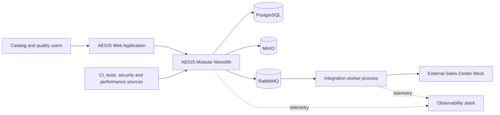
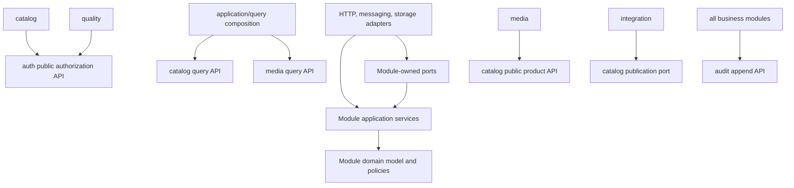
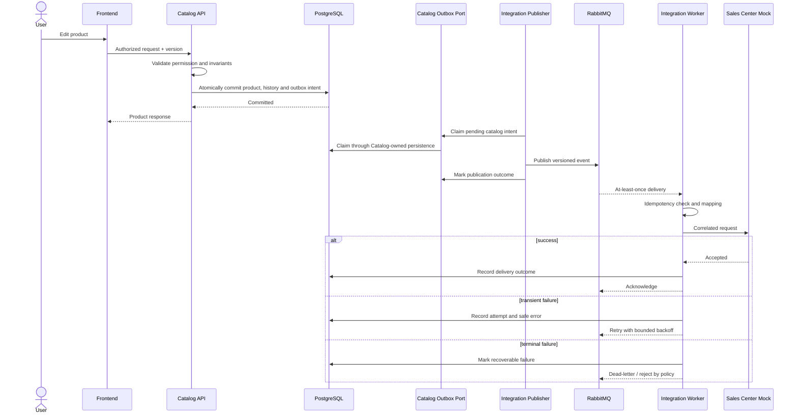
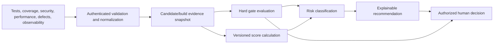

# AEGIS Architecture

## Status and context

This document defines the intended initial architecture. It is not a claim that components already exist. The modular-monolith direction is accepted in [ADR-001](ADR/ADR-001-modular-monolith.md). Material changes require impact analysis and, when difficult to reverse or broadly consequential, an [Architecture Decision Record](ADR/README.md).

AEGIS must support a real catalog workflow and a quality/release workflow while remaining understandable and locally reproducible. The primary architectural risk is adding distributed-system complexity for portfolio appearance rather than for a product need. The initial style is therefore a **modular monolith**, with asynchronous messaging only at boundaries that benefit from decoupling and recovery.

## Principles and constraints

1. Simplicity before complexity.
2. Modular monolith first; extraction requires measured pressure and an ADR.
3. Quality Engineering is part of architecture.
4. Security, observability and testability are designed in.
5. Internal boundaries have explicit ownership and dependency direction.
6. Transactional consistency is preferred inside one module; cross-boundary workflows expose recoverable state.
7. At-least-once message delivery and idempotent consumers are assumed.
8. Failure is explicit, observable and bounded.
9. Automation supports, but does not replace, risk analysis and exploratory testing.
10. Technology is selected to solve a concrete problem.

Kubernetes, Kafka, service mesh, event sourcing, CQRS, blockchain, Elasticsearch and microservices are prohibited until an approved ADR answers: **What measured problem are we solving, why is the current design insufficient, and what operational cost are we accepting?**

## System context

The integration worker may initially share the same codebase and deployment artifact while running as a distinct process profile. This preserves module reuse without pretending there are independent services.

## Logical containers

| Container | Responsibility | Initial direction |
| --- | --- | --- |
| Web application | Accessible user workflows for Commerce and Quality Control Center | React + TypeScript, after foundation approval |
| Application/API | HTTP contracts, query composition, modular business logic and ingestion | Java + Spring Boot, modular monolith |
| Integration worker | Consume outbound work, call mock downstream, retry and report status | Same backend codebase, separate runtime profile if useful |
| PostgreSQL | Transactional source of truth, constraints, history, audit metadata and outbox | One logical database with module-owned schemas/tables |
| RabbitMQ | Durable asynchronous delivery at integration/media boundaries | Added only in its roadmap phase |
| MinIO | Product images and future evidence objects where appropriate | Object references and checksums kept in PostgreSQL |
| External Sales Center Mock | Controlled contract, latency and failure behavior | Never treated as trusted/internal |
| Observability stack | Collection and visualization of telemetry | OpenTelemetry, Prometheus and Grafana in later phases |

## Module boundaries

### `auth`

Owns users, roles, permissions, credential/session concerns and authorization policy. It exposes authenticated actor identity and permission checks; other modules must not read credential tables directly.

### `catalog`

Owns products, categories, SKU, price, stock, product state, product history and the durable transactional intent for catalog domain events. A catalog transaction may atomically persist the aggregate, history and its outbox intent. Catalog does not depend on Media and does not perform downstream HTTP calls inside catalog transactions.

### `media`

Owns media objects, media metadata, validation, processing state, safe storage interaction and product image associations. It may use Catalog's public product interface to validate a product reference; Catalog never calls Media. Media treats uploaded files as hostile.

### `integration`

Owns publication orchestration, external payload mapping, delivery attempts, retry, idempotency, downstream handling and replay. It does **not** own or write the catalog event intent. It claims/marks pending intents only through a Catalog-owned publication port and never accesses Catalog persistence directly.

### `quality`

Owns releases, candidates, test catalog/results, evidence metadata, defects, findings, metrics, versioned policies, gate evaluations, scores, risk and recommendations. It does not authorize deployment automatically.

To prevent a single internal “god object,” `quality` maintains conceptual internal sub-boundaries while remaining one module:

- **evidence catalog and ingestion:** suites, cases, executions, results, provenance and evidence metadata;
- **release evidence:** releases, candidates, defects, findings, performance results and traceability;
- **policy and evaluation:** versioned gates, score formulas, risk policies and deterministic evaluations;
- **decision:** recommendation presentation, authorized final decision and exceptions.

These are internal packages/responsibility boundaries, not separate services or independently owned databases.

### `audit`

Owns append-only audit records, retention/redaction policy and authorized queries. Modules submit safe audit facts through an explicit append boundary carrying actor and correlation snapshots; Audit does not call Auth or a source module to reconstruct them and therefore introduces no dependency cycle.

### Application/query composition boundary

This boundary sits above module application APIs and builds client-oriented read representations that need data from more than one module. For example, a combined product view may read Catalog product data and Media metadata independently. It contains no domain rules, owns no transactional state and must not let Catalog depend on Media.

## Dependency rules

- Domain logic must not depend on framework, HTTP, broker or object-storage details.
- Cross-module access uses an explicit public application API or published event; direct access to another module's repository/table is forbidden.
- Cyclic module dependencies are forbidden. Shared technical utilities remain small and contain no business rules.
- Catalog never depends on Media. Client representations that combine their data are assembled only by the application/query composition boundary.
- The Catalog-owned publication port is the only interface through which Integration may claim or update catalog outbox intent state.
- Database foreign keys may exist across module boundaries only when ownership, lifecycle and coupling are deliberate and documented. Stable IDs plus module APIs are preferred where lifecycle independence matters.
- Internal module calls are synchronous and in-process by default. Messaging inside the monolith requires a concrete recovery or decoupling need.

## Primary flows

### Catalog change and external synchronization

The catalog response does not claim that external synchronization or its audit projection has completed. Catalog owns the intent and its persistence; Integration owns publication and delivery behavior. The outbox closes the database/broker dual-write gap. Publisher claiming and consumer idempotency must tolerate restart and duplicate delivery.

## Atomicity and consistency guarantees

| Concern | Guarantee | Boundary |
| --- | --- | --- |
| Product state + product history + catalog outbox intent | **Atomic** in one Catalog-owned database transaction | `catalog` |
| Outbox intent publication to RabbitMQ | **Eventually consistent**, recoverable and at-least-once | `catalog` publication port -> `integration` publisher |
| External Sales Center delivery | **Eventually consistent**, idempotent and retry-bounded | `integration` -> external boundary |
| Catalog business audit projection | **Eventually consistent** from the committed catalog intent unless classified as a critical fail-closed action | `catalog` -> `audit` append boundary |
| Designated security-critical audit events | Durable audit acceptance is required before the command may report success; exact transactional protocol is selected before implementation | source module -> `audit` append boundary |
| Combined Product/Media client view | Read-time composition; no cross-module transaction or domain dependency | application/query composition boundary |

Audit facts carry immutable actor ID/type, action, target, outcome, time and correlation context. Audit never queries Auth during append. If eventual audit projection fails, it is retried and alerted; it cannot mutate the original product transaction.

### Quality evidence and release decision

Ingestion is idempotent by source and execution identity. Missing, stale or incompatible evidence is visible and cannot be silently interpreted as passing. Historical evaluations retain their policy/formula version.

### Media processing

1. The API authorizes the actor and validates metadata, declared limits and product context.
2. File content is streamed with size limits, signature/type validation and a generated object name.
3. The object remains non-public and pending until approved processing/inspection succeeds.
4. Processing creates approved variants and records checksums, dimensions and status.
5. Failure becomes a visible terminal or retryable state; product reads remain available.
6. Deletion/retention handles both metadata and objects without breaking audit requirements.

## Communication contracts

### HTTP

- JSON over HTTPS outside local development.
- Versioned path prefix (`/api/v1`) for public conceptual contracts.
- Stable error shape with machine code, safe message, field details, correlation ID and timestamp.
- Optimistic concurrency for material updates, initially through a version field or `ETag`/`If-Match` decision to be finalized.
- Bounded pagination and deterministic sorting.
- Idempotency keys for eligible retried create/command operations.

### Events and messages

Each envelope contains:

- unique `eventId`;
- `eventType` and `schemaVersion`;
- `occurredAt` and producer identity;
- aggregate/entity ID and aggregate version where applicable;
- correlation and causation IDs;
- payload containing the minimum necessary data.

Breaking schemas use a new version with a compatibility/migration window. Consumers ignore unknown additive fields and reject unsupported required versions visibly. Message payloads must not contain credentials, raw tokens or unnecessary personal data.

## Persistence and consistency boundaries

- PostgreSQL is the source of truth for transactional state.
- Each module owns its tables and migrations even when deployed in one database.
- A Catalog transaction atomically updates its aggregate, product history and Catalog-owned outbox intent. Audit is accessed only through its explicit boundary under the guarantee described above.
- Cross-module or external workflows use eventual consistency with an explicit status.
- Money uses fixed precision and currency; timestamps are stored as UTC instants; IDs are opaque and stable.
- Optimistic concurrency prevents silent lost updates to mutable catalog and policy records.
- Binary objects live in MinIO; the database stores metadata, checksum and opaque object key.

See [DATA_MODEL.md](DATA_MODEL.md) for conceptual entities. Physical schema and migration tools require an ADR or implementation plan decision.

## Integration boundaries

The External Sales Center Mock is outside the trust and transactional boundaries. Calls require:

- explicit timeout shorter than the worker processing lease;
- retry classification and bounded attempts;
- idempotency key/event identity;
- contract tests owned by both adapter expectations and mock behavior;
- sanitized telemetry;
- circuit breaking only if measurements show retry storms or sustained downstream failure;
- reconciliation/replay that is authorized and audited.

The mock must emulate realistic outcomes but must not make production claims about an unspecified real provider.

## Fault and failure scenarios

| Scenario | Expected behavior | Required evidence/telemetry |
| --- | --- | --- |
| External service unavailable/timeout | Catalog commit succeeds; integration retries then becomes recoverably failed | event ID, attempts, latency, classified error, queue depth, trace |
| Duplicate message | Consumer detects prior processing and avoids duplicate effect | duplicate counter, idempotency record and correlated log |
| Publisher crash after broker publish | Duplicate may occur; no committed change is lost | outbox state, publish attempt and consumer idempotency result |
| RabbitMQ unavailable | Outbox accumulates safely; API health shows degraded dependency without losing catalog writes | unpublished age/count, connection state and alert |
| Image processor failure | Media becomes failed/retryable; existing catalog remains readable | media ID, stage, reason code, attempt and trace |
| MinIO unavailable | Upload/processing fails safely without dangling ready metadata | storage error class, cleanup/reconciliation signal |
| Database latency/unavailability | Requests time out within budget, fail without partial state and expose dependency degradation | pool, query latency, timeout count and traces without raw SQL data |
| Random API 500 | Stable safe error response; correlation permits investigation | error code, exception classification, trace and request metric |
| Stale concurrent update | Update rejected as conflict, newer state preserved | product ID/version and conflict metric |
| Invalid quality evidence | Payload rejected/quarantined; existing release evaluation remains unchanged | source, schema error, ingestion ID and rejection metric |
| Missing/stale quality source | Quality summary shows insufficient/stale evidence; policy may block | source freshness, expected/received timestamps and gate reason |
| Quality Engine error | No fabricated score; last evaluation clearly marked stale or unavailable | formula version, input set ID, calculation error and alert |

## Testability mechanisms

- Business policies are deterministic and separated from I/O.
- Time, IDs, external clients and retry scheduling are injectable through owned ports.
- APIs and events have schemas/examples suitable for contract checks.
- Each asynchronous operation exposes status and stable correlation identifiers.
- Seed/build identity and controlled test data are observable.
- Fault Lab controls are explicit, scoped, time-limited and unavailable in production.
- Telemetry supports assertions on outcomes without making implementation-specific logs the only oracle.

## Deployment and local execution direction

No runtime is created in the foundation phase. When implementation begins, the intended developer shape is:

- frontend and backend runnable directly for fast development;
- PostgreSQL and, only in their phases, RabbitMQ and MinIO supplied through Docker Compose;
- one documented bootstrap command/path, health checks and deterministic seed data;
- no requirement for Kubernetes or a cloud account;
- integration worker independently startable when asynchronous integration exists.

### Phase 01 planning baseline

The approved future baseline is:

| Concern | Decision |
| --- | --- |
| JDK | 25 LTS |
| Framework | Spring Boot 4.1.x |
| Build | Maven |
| Packaging | Executable Jar |
| Maven coordinates | `io.github.sytef:aegis` |
| Base package | `io.github.sytef.aegis` |
| CI | GitHub Actions with `permissions: contents: read`; additional permissions require explicit justification |

Phase 01 remains limited to one buildable application skeleton, liveness/readiness/info, Problem Details errors, bounded correlation IDs, unit/component validation and least-privilege CI. It contains no frontend, PostgreSQL, RabbitMQ, MinIO, catalog CRUD/business logic, real authentication, Quality Engine or Grafana. The detailed contracts are in [API_SPEC.md](API_SPEC.md#phase-01-operational-contracts) and [PLANS.md](../PLANS.md#phase-01--minimal-executable-backend-foundation).

## Evolution rules

A module may be considered for extraction only if evidence shows a need such as independent scaling, isolation, release cadence, ownership or reliability boundaries that the monolith cannot reasonably meet. Before extraction, verify that module ownership, contracts, observability and data boundaries are already healthy. Distribution is not a remedy for poor modularity.

## Open decisions

- Authentication/session mechanism and identity library.
- Backend/frontend project structure and modularity enforcement tool.
- Optimistic concurrency representation (`version` field versus HTTP ETag semantics).
- Physical database schema strategy and migration tool.
- Evidence object storage policy and retention.
- RabbitMQ topology, retry mechanism and dead-letter/replay workflow.
- Quality formula, weights, freshness windows and exception authority.
- Physical protocol for designated fail-closed audit acceptance without circular dependencies.

These decisions are scheduled for refinement in [PLANS.md](../PLANS.md) and future ADRs.
