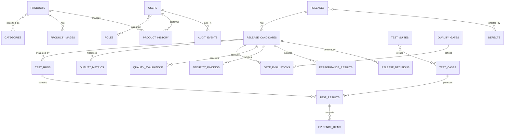
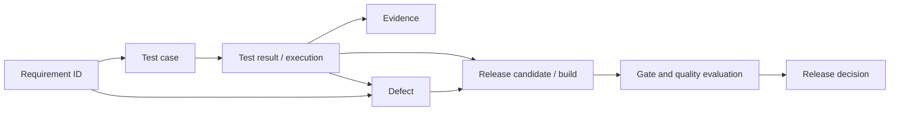

# AEGIS Conceptual Data Model

## Purpose

This model describes business concepts, ownership, identity and relationships. It intentionally does not define SQL DDL, indexes or framework mappings. Tables should be introduced only when a requirement needs durable state; physical design will be validated against access patterns and documented through migrations.

## Modeling principles

- PostgreSQL will be the transactional source of truth unless an ADR changes it.
- Each entity has an opaque stable ID; public/business identifiers such as SKU and release version are separate.
- Timestamps are UTC instants. Display localization is a client concern.
- Money uses fixed decimal semantics plus ISO 4217 currency.
- Mutable aggregates use a version for optimistic concurrency.
- Deactivation/retention is preferred to destructive deletion where history, audit or traceability must survive.
- Sensitive fields are minimized, protected and never copied into history/evidence without need.
- Object binary data belongs in object storage; PostgreSQL stores metadata and opaque references.
- Quality evaluations retain the policy/formula version and source snapshot needed to explain historical results.

## Domain ownership summary

| Module | Owned concepts |
| --- | --- |
| `auth` | users, roles, permissions, role assignments, sessions/credentials as later designed |
| `catalog` | products, categories, product-category associations, product history, catalog outbox intents |
| `media` | product images, media processing attempts/metadata |
| `integration` | publication/delivery attempts, downstream mappings, consumer idempotency records |
| `quality` | releases/candidates, suites, cases, runs, results, evidence metadata, metrics, gates/evaluations, defects, findings, decisions |
| `audit` | audit events |

## Commerce and identity entities

### `users`

Represents a human or approved service identity.

Key concepts: stable ID, unique normalized login/email identifier, display name, active status, credential/session reference (not raw secret), created/updated timestamps and concurrency version. Authentication secrets must be separated and protected according to the chosen identity mechanism.

Relationships:

- many-to-many with `roles` through a role assignment concept;
- actor reference from product history, audit events and release decisions;
- may be deactivated, not silently erased from historical attribution.

### `roles`

Groups named permissions for RBAC. Key concepts: stable ID, unique name, description, active status and policy version. Permissions may be modeled as code-defined capabilities initially; a database permission table is added only if dynamic management is required.

### `categories`

Classifies products. Key concepts: stable ID, unique normalized name or slug, display name, description, active status, timestamps and version. Hierarchy is not assumed in v1; a parent relationship requires a product requirement and cycle rules.

### `products`

The catalog aggregate root. Key concepts: stable ID, unique normalized SKU, name, description, fixed-decimal price, currency, non-negative integer stock, lifecycle status, timestamps and concurrency version.

The product owns invariants for allowed changes. Category association can be one-to-many or many-to-many; the initial product decision should choose the smallest model that meets actual catalog requirements. The conceptual model permits multiple category associations without requiring them in the first implementation. No `draft` lifecycle state is assumed because no approved requirement currently needs it.

### `product_images`

Media metadata associated with a product. Key concepts: stable ID, product ID, opaque storage key, original safe filename metadata, detected media type, byte size, checksum, width/height, processing status, display order, primary flag, failure reason code, timestamps and version.

Binary content is not stored here. A ready state means required validation/processing succeeded; association does not make an object publicly accessible by default.

### `product_history`

Append-only business history of material product changes. Key concepts: history ID, product ID, actor ID, action, occurred time, correlation ID, source and safe structured change set or snapshot. It supports business traceability and is distinct from general security audit logging.

### `audit_events`

Append-only record for security- and business-relevant actions. Key concepts: event ID, occurred time, actor type/ID, action, target type/ID, outcome, reason code, correlation/trace ID, source context and sanitized metadata.

Audit records must not store credentials, tokens, full file content or arbitrary request bodies. Retention and access are policy-controlled.

The actor relationship is logical attribution, not permission for Audit to query Auth during append. The event carries an immutable actor type/ID snapshot through the audit boundary; whether a cross-module foreign key is safe remains a physical-design decision.

## Reliability support concepts

These concepts are justified by [integration reliability requirements](REQUIREMENTS.md#external-integration-int), not by a desire to create artificial tables.

### `catalog_outbox_intents`

Catalog-owned durable intent to publish a committed domain event. Key concepts: event ID, type, schema version, aggregate ID/version, payload, occurred time, correlation/causation IDs, claim/publication state and published time. Product state, product history and this intent are written atomically. Integration may claim and mark intent only through a Catalog-owned publication port; it never writes the intent directly. Payload minimization and retention apply.

### `integration_deliveries`

Tracks downstream processing outcome. Key concepts: delivery ID, event ID, target, state, attempt count, last safe error classification, next attempt, first/last attempt time and completion time.

### `idempotency_records`

Records a consumed message or eligible HTTP command identity and outcome fingerprint within a defined retention window. It prevents duplicate business effects; it does not promise global exactly-once delivery.

## Quality domain entities

### `releases`

Represents a logical versioned delivery scope such as `v1.0.0`. Key concepts: stable ID, unique version, title, description/scope, lifecycle status, created/finalized timestamps and concurrency version.

A release groups candidates and their decisions; it is not itself a mutable build. A release must not claim readiness when the selected candidate, build identity or required evidence is ambiguous.

### `release_candidates`

Represents one evaluation attempt for a release. Key concepts: candidate ID, release ID, candidate label/sequence, immutable build identity, target environment, evidence cutoff, lifecycle status and created/evaluated timestamps. One release may have several candidates, but an approval identifies exactly one candidate. A rejected or superseded candidate remains historical.

“Release candidate” is a domain concept justified by repeated builds/evaluation attempts; the physical schema may embed it initially only if one candidate per release is enforced explicitly. It must never permit a different build to silently replace evaluated evidence.

### `test_suites`

Logical grouping of cases by capability, layer or execution purpose. Key concepts: ID, stable external reference, name, layer/type, owner, active status and version. Suite membership must not be the sole requirement traceability mechanism.

### `test_cases`

Test design record. Key concepts: ID, stable external ID such as `TC-API-CAT-001`, title, intent, test layer, risk tags, automation status, owner, lifecycle status, preconditions and optional source reference. Detailed steps may remain in executable code or a linked system when duplication would become stale.

A case can cover multiple requirements and a requirement can have multiple cases; this requires an explicit association carrying coverage type where useful.

### `test_runs`

One execution session from an approved source. Key concepts: run ID, effective source/source run ID (idempotency pair), release candidate/build identity, suite scope, environment, trigger, started/finished time, overall status, tool/version and ingestion status.

### `test_results`

One case/scenario outcome within a run. Key concepts: result ID, run ID, case ID or stable test reference, status (`passed`, `failed`, `blocked`, `skipped`, `error`), duration, attempt, failure classification, safe summary and timestamps.

Skipped, blocked and infrastructure-error results remain distinct from pass/fail. Retry results do not erase the first failure.

### `evidence_items`

Metadata pointing to logs, screenshots, traces, reports or artifacts. Key concepts: evidence ID, result/finding/experiment association, type, source, opaque URI/object reference, checksum, content type, created time, retention class and sensitivity classification. Whether binary evidence uses MinIO or CI artifact storage is an open decision.

### `quality_metrics`

Normalized, timestamped measurements used in evaluation. Key concepts: metric ID, release candidate/build identity, name, value, unit, dimension/source, measured time, freshness status and provenance. Examples include pass rate, requirement coverage, defect counts, latency percentiles and error rate.

Raw high-cardinality operational time series remain in the observability system; only evaluation-relevant snapshots/references should be copied here.

### `quality_gates`

Versioned policy definition. Key concepts: gate ID, stable code, name, stage, severity, expression/rule configuration, required inputs, blocking behavior, active window and policy version. Gate policy is not silently overwritten.

### `gate_evaluations`

Immutable result of applying a gate version to a candidate evidence snapshot. Key concepts: evaluation ID, release candidate/build identity, gate ID/version, status (`passed`, `failed`, `insufficient_evidence`, `not_applicable`, `error`), evaluated time, input snapshot/reference and human-readable reasons. `not_applicable` also records the authorized actor, rationale, policy version and audit reference.

### `quality_evaluations`

One explainable Quality Engine result. Key concepts: evaluation ID, release candidate/build identity, formula version, evidence cutoff/snapshot, score, risk level, recommendation, contributing metrics, missing-data treatment and calculation time.

This record complements but never replaces individual `gate_evaluations`.

### `defects`

Normalized defect reference. Key concepts: ID, external system/reference, title, severity, priority, lifecycle status, affected component, owner, created/resolved time and safe summary. Associations link defects to requirements, test results and releases without duplicating an entire external tracker.

### `security_findings`

Normalized security result. Key concepts: ID, effective source/fingerprint, release candidate/build identity, rule/CWE where known, severity, confidence/exploitability context, component/location, status, first/last seen, remediation reference and evidence link. Deduplication policy must be source-aware.

### `performance_results`

Scenario-level snapshot. Key concepts: ID, release candidate/build identity, scenario, workload profile, duration, percentile latencies, throughput, error rate, resource context, threshold policy version, outcome and report evidence link.

### `release_decisions`

Immutable decision record. Key concepts: decision ID, release ID, exact candidate/build identity, decision (`approved`, `blocked`, `approved_with_exception` if policy permits), actor, time, rationale, evidence/quality evaluation reference and exception expiry/conditions.

Recommendations are machine-produced; decisions are human-owned. Reconsideration creates another attributed record rather than editing history.

## Traceability associations

Requirements may initially live in documentation rather than a `requirements` table. Stable IDs are still first-class references. A durable requirements entity is justified only when the Quality Control Center needs lifecycle/query behavior beyond synchronized metadata.

Conceptual requirement traceability:

## Lifecycle constraints

- Product: active/inactive states require explicit transition rules; physical deletion is not assumed. A future draft state requires a new approved requirement.
- Media: pending -> processing -> ready or failed; retry returns an eligible failed item to processing without inventing a new successful history.
- Release: planned -> open -> finalized/closed. Each candidate separately moves through collecting evidence -> evaluated -> decided/superseded; reopening or superseding is audited.
- Test result: immutable after accepted ingestion except for safe enrichment; a corrected source result creates a new version/attempt relationship.
- Defect/finding: closure preserves severity and history at the time a release was evaluated.
- Audit and evaluation records are append-only from normal product workflows.

## Data integrity and concurrency

- Database uniqueness backs normalized SKU, release version, event ID and approved ingestion/idempotency keys.
- Foreign keys enforce relationships inside an ownership boundary when lifecycle permits.
- Application and database checks both protect critical numeric/state invariants.
- Optimistic version checks protect mutable aggregates from lost updates.
- A catalog transaction records product state, history and Catalog-owned outbox intent atomically when required.
- Consumers record idempotency and business outcome in one transaction where possible.
- Reconciliation jobs identify orphan objects, stuck outbox work, incomplete runs and stale evidence; they do not silently repair ambiguous data.

## Retention, privacy and classification

Before production use, each data class needs an owner and retention schedule. Initial categories:

- credentials/tokens: secret, never logged or stored in evidence;
- user identity: restricted personal data, minimized;
- product/catalog: internal/business data;
- audit/security findings: restricted, integrity-sensitive;
- test evidence: classify per content; redact before broad access;
- operational telemetry: minimize identifiers and cap retention/high cardinality;
- object media: validate rights and lifecycle, keep private by default.

Deletion requests must reconcile privacy obligations with legitimate audit retention through documented policy, pseudonymization where appropriate and legal review before real personal data is used.

## Physical design questions

- UUID/ULID choice and external ID encoding.
- Single schema versus schema per module.
- Category cardinality and hierarchy requirement.
- Product currency scope and SKU reuse policy.
- History representation: structured diff, selected snapshot or hybrid.
- Evidence binary storage and retention.
- Release/candidate/build identity constraints and whether build identity becomes a separate physical table.
- Quality metric normalization versus JSON payload for evolving sources.
- Partitioning/archival thresholds for audit, history and execution data based on measured volume.
