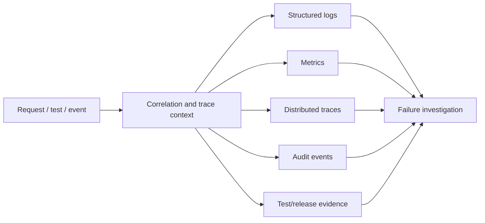

# AEGIS Observability Strategy

## Purpose

Observability enables engineers to explain system behavior from emitted signals. For AEGIS, it is also a Quality Engineering capability: tests and release evidence should help an investigator cross HTTP, database, message, worker and downstream boundaries without guessing.

This document defines future instrumentation requirements. OpenTelemetry, Prometheus and Grafana are preferred but will be introduced incrementally when executable components exist. Their adoption remains subject to proportional implementation planning.

## Principles

- Instrument critical flows and failure boundaries during design, not after incidents.
- Prefer structured, consistent and queryable signals over prose-heavy logs.
- Correlate logs, metrics, traces, audit records, test evidence and releases.
- Record outcomes and safe context, never secrets or arbitrary payloads.
- Control cardinality, volume, retention and cost.
- Make unknown, stale and telemetry failure explicit.
- Alerts represent actionable user/system risk rather than every error line.
- Telemetry validates hypotheses but is not the only source of product truth.
- Instrumentation failures must not silently break business logic; required security audit follows its stricter policy.

## Signal model



## Correlation and trace identifiers

### Correlation ID

A correlation ID represents a logical business/diagnostic flow and may outlive a single synchronous trace. Rules:

- accept `X-Correlation-ID` only if it matches length/character constraints; otherwise generate a new opaque ID;
- return the effective ID on API responses, including safe error responses;
- propagate it through module calls, outbox events, broker messages, integration requests, audit and quality evidence;
- preserve causation links when one event causes another;
- do not encode user, environment or secret data into the ID;
- log it as a structured field, not only in message text.

### Trace and span IDs

OpenTelemetry trace context represents one causal execution path. Incoming trusted-compatible context may be continued after validation; otherwise new context is created. Async publish and consume use messaging span/link semantics so delays and retries are visible. Trace IDs are returned or linked in diagnostic evidence where safe.

Correlation ID and trace ID are related but not interchangeable: retries/replays may share a business correlation while producing new traces.

### Test execution linkage protocol

A single test result may trigger zero, one or many HTTP/message flows. Evidence therefore stores a bounded collection of request links rather than one ambiguous identifier:

1. The runner identifies the exact test execution/result, release candidate and immutable build under test.
2. For each relevant request, it may send a valid `X-Correlation-ID` or capture the server-generated value returned in the response.
3. The runner records an ordered request link containing sequence, effective correlation ID, safe route/operation, occurred time and outcome.
4. When trace access is authorized, the link adds the associated trace ID(s); one correlation may map to multiple traces after retry/replay.
5. The result evidence stores the bounded link collection or an immutable artifact reference/checksum when the collection exceeds the ingestion schema limit.
6. QCC ingestion validates the candidate/build, effective source and schema before accepting these links.

Correlation and trace IDs are diagnostic pointers, not proof that an assertion passed. They are never Prometheus labels. Raw URLs, headers, bodies and credentials are excluded from request links. The exact collection-size limit is set with the evidence ingestion schema before Phase 06.

## Structured logs

Preferred format is JSON in shared environments and human-readable structured output locally. Common fields:

- UTC `timestamp`, severity and stable event name/code;
- service/process, module, environment and version/build;
- correlation ID, trace ID and span ID;
- request route template and HTTP method/status (not raw sensitive URL);
- actor/service ID where policy permits, never credentials;
- entity/event/release-candidate/test-run ID where diagnostically relevant;
- outcome, duration and safe error classification;
- retry attempt, dependency/operation and message schema/event ID for async work.

Log levels:

- `DEBUG`: local/targeted diagnostic detail, disabled or sampled in normal shared operation;
- `INFO`: lifecycle and successful material outcome, avoiding per-item noise;
- `WARN`: recovered degradation, retry, rejected suspicious input or approaching limit;
- `ERROR`: failed operation needing investigation or terminal processing failure.

Stable event names are preferable to parsing prose, for example `catalog.product.updated`, `integration.delivery.retry_scheduled` and `quality.gate.failed`.

Never log passwords, tokens/cookies, authorization headers, signed URLs, secrets, full request/response bodies, uploaded binary content, raw SQL parameters containing data or unnecessary personal data. Redaction is allowlist-based and tested. Control characters are sanitized to prevent log injection.

## Metrics

Metrics use stable, low-cardinality labels. Product, dependency and quality dimensions include:

### HTTP/application

- request count, duration histogram and error count by route template/method/status class;
- active requests and rejected/rate-limited requests;
- validation, authentication and authorization denial counts (safe labels only);
- JVM/process/runtime saturation when backend exists.

### Catalog/data

- product command outcomes and concurrency conflicts;
- database operation/transaction duration, pool utilization and timeouts;
- history/audit append failures;
- reconciliation discrepancies (stuck/orphan data), not raw entity IDs as labels.

### Media

- uploads accepted/rejected by safe reason class;
- processing duration and success/failure/retry counts;
- pending/failed age and count;
- object-storage dependency errors and cleanup backlog.

### Messaging/integration

- outbox unpublished count and oldest age;
- publish outcome/duration;
- queue depth/consumer lag and oldest-message age where available;
- delivery success/retry/terminal/duplicate counts;
- downstream latency/error/timeout by operation, without full URL/customer labels;
- retry attempts and dead-letter/recoverable failure backlog.

### Quality Control Center

- ingestion accepted/rejected/duplicate counts by approved source/type;
- ingestion lag and evidence freshness;
- test result counts by layer/status and first-attempt/retry distinction;
- gate outcomes, hard-block count and evaluation errors;
- score/risk distribution by release class/formula version (avoid release ID labels);
- open defect/finding counts by severity and age buckets;
- final decision/recommendation mismatch and exception age.

### Fault Lab

- active fault count by allowlisted scenario/environment;
- activation/expiry/emergency-stop outcomes;
- experiment recovery duration;
- permanent visible banner/state when any fault is active.

Prometheus label values must not contain SKU, product ID, user ID, correlation ID, trace ID, raw exception or release version if unbounded. Those belong in logs/traces with appropriate controls.

## Traces

Trace critical paths:

- login/session validation and authorization decision (without credentials/policy secrets);
- catalog create/update through database commit and outbox creation;
- outbox claim/publish, broker delivery, worker processing and downstream request;
- media upload metadata, object interaction and processing stages;
- quality ingestion validation/normalization/persistence;
- gate/score/risk evaluation and release decision recording.

Spans identify module operation, outcome, duration and safe dependency attributes. Database instrumentation records operation/table or sanitized statement shape, not sensitive bound values. HTTP spans use route templates. Messaging spans carry event type/version and event ID in controlled attributes or logs without high-cardinality metric labels.

Sampling policy must preserve errors and critical release/fault experiments while controlling normal traffic volume. Head/tail sampling choice and collector availability are later operational decisions. A missing trace is not interpreted as a passed operation.

## Health checks

| Check | Meaning | Behavior |
| --- | --- | --- |
| Liveness | Process is running and not irrecoverably deadlocked | Does not fail merely because a recoverable external dependency is down |
| Readiness | Instance can safely accept its intended work | Reflects critical dependency/migration/startup readiness; prevents premature traffic |
| Startup | Slow initialization/migration has completed | Separates startup grace from runtime liveness when platform supports it |
| Dependency detail | Authorized diagnostic state for DB/broker/store/downstream | Not publicly exposed with hostnames, credentials or internals |

The public health response is minimal. Catalog API readiness policy must distinguish core database necessity from asynchronous broker/downstream degradation: downstream failure should not unnecessarily disable catalog reads/writes when the outbox can safely accumulate. Worker readiness depends on the broker/database boundary it needs.

Quality evidence source freshness is a quality status, not process liveness.

## Dashboards

Dashboards are views over version-controlled/owned signals, not the only place definitions live.

### System overview

- request rate, errors and latency by module;
- runtime/database saturation;
- dependency health;
- current deployment/build and active Fault Lab state.

### Catalog and media

- catalog command/read outcomes and concurrency conflicts;
- database latency/timeouts;
- media pending/failure age, processing duration and object-store health.

### Integration reliability

- outbox backlog and oldest age;
- publish/consume/delivery rate;
- retries, duplicate outcomes, terminal failures and replay activity;
- downstream latency/error rate and recovery.

### Release quality

- evidence freshness/coverage by release;
- suites/results and first-attempt stability;
- defects/findings, performance thresholds and gate outcomes;
- score/risk/recommendation with formula/policy version;
- hard blockers, exceptions and final human decision.

### Fault experiment

- experiment hypothesis/time window and active injected fault;
- steady-state indicator, affected flow and dependency signal;
- trace exemplars, recovery time and abort condition;
- linked test run/evidence/conclusion.

## Alerts

Alerts require an owner, severity, actionable description, investigation link and tested runbook. Initial candidates, after baselining:

| Condition | Rationale | Initial response |
| --- | --- | --- |
| API error rate/latency exceeds sustained threshold | user-visible degradation | inspect deployment, route and dependency traces |
| Database pool saturation/timeouts | cascading availability risk | inspect slow operations, connection usage and recent changes |
| Outbox oldest age/backlog grows | committed changes not reaching broker | inspect publisher/broker and stuck claims |
| Integration terminal failures or retry surge | downstream divergence/retry storm | classify downstream response, pause/replay safely |
| Media failure/backlog age grows | product media unavailable/stuck | inspect processor/storage and resource limits |
| Required audit append fails | accountability/security risk | invoke fail-closed policy and investigate storage/path |
| Evidence source stale or ingestion rejection spikes | release decision may be invalid | block/mark unknown and inspect source/schema/auth |
| Quality gate evaluation error | no reliable recommendation | mark evaluation unavailable and investigate formula/input |
| Critical security finding ingested | immediate release risk | validate, notify owner and hard-block affected release |
| Fault remains near TTL or stop fails | containment risk | emergency stop and environment owner escalation |

Avoid alerting on every individual 4xx, retry or failed test. Aggregate and route according to impact. Thresholds start as dashboard observations, become alerts after baseline, and become hard gates only under versioned quality policy.

## QA-assisted failure investigation

For an automated or exploratory failure, QA should be able to:

1. Identify exact requirement/test case, release candidate/build, environment, data identity and attempt.
2. Copy the response correlation ID or evidence trace ID.
3. Locate the request span and determine whether failure occurred in UI, API/module, database, broker, worker, storage or downstream.
4. Compare metrics around the execution window for latency, saturation, queue/backlog and fault activation.
5. Query structured logs by correlation/event/run ID for safe classified outcomes.
6. Distinguish product assertion failure from infrastructure, test data, stale evidence or tool failure.
7. Preserve minimum useful evidence and link it to a defect/release without copying secrets.
8. Reproduce with controlled data/fault if safe, then verify recovery and telemetry.

Example:

```text
TC-INT-CAT-004 failed on build abc...
  -> correlationId links catalog commit and outbox event
  -> eventId links publish, consumer and delivery attempts
  -> trace shows downstream timeout at 2 s
  -> metric shows bounded retries and outbox remains healthy
  -> integration status becomes recoverably failed
  -> no duplicate downstream effect after replay
```

QA does not assert private log wording as the only correctness oracle. Stable state/API contracts prove behavior; telemetry explains behavior and recovery.

## Release and deployment correlation

Every runtime and telemetry resource identifies application version, immutable commit/build and environment as resource attributes. Deployment/change markers allow dashboards to compare before/after behavior. Quality evidence must target the exact candidate and same build identity used by runtime/deployment; release display version alone is insufficient.

## Observability testing

- Component/integration tests assert required structured events/attributes for critical outcomes without overspecifying prose.
- Redaction tests inject canary-like fake secrets/personal values and verify they are absent from logs/traces/errors.
- Trace propagation tests cross HTTP, outbox/message and downstream mock.
- Metric tests check bounded label sets and correct outcome classification.
- Health checks are tested under dependency failure and recovery.
- Alert rules/runbooks are exercised with safe synthetic/fault scenarios.
- Fault Lab experiments require expected telemetry and recovery evidence.

## Retention, access and reliability

Retention varies by signal/classification and must be defined before hosted production. Access follows least privilege: broad dashboard access does not imply raw security/audit/evidence access. Telemetry systems must have quotas, backpressure and disk/collector failure behavior; application threads must not block indefinitely on export.

Audit is not equivalent to application logging and may require stronger integrity/retention. Quality evidence references may outlive high-volume traces, so necessary diagnostic excerpts or immutable links follow an explicit evidence policy.

## Open decisions and risks

- Collector/topology and local Docker Compose profile.
- Log/trace backend; Prometheus/Grafana alone do not provide long-term log/trace storage.
- Sampling, retention, data residency and cost constraints.
- Concrete service-level objectives and alert thresholds after baseline.
- Whether evidence snapshots retain selected trace/log excerpts when telemetry expires.
- Safe correlation visibility in client UI and access-controlled support workflows.
- Audit storage/tamper-evidence design distinct from normal logs.
- Operational ownership/on-call expectations for a portfolio project.
