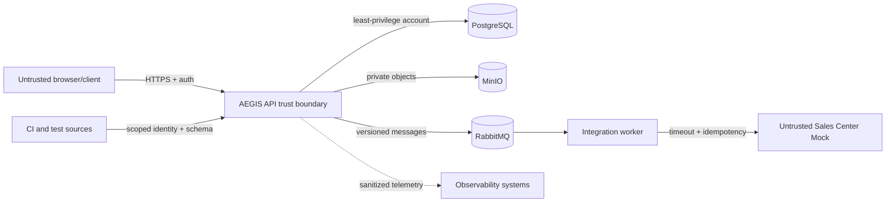

# AEGIS Security Strategy

## Purpose and current status

Security is a design constraint across AEGIS Commerce, the Quality Control Center and Fault Lab. This document defines the initial policy and threat model; it does not claim security controls have been implemented or that the future system is production-certified.

Security findings are evidence for release decisions. Automated scanning supports but does not replace threat modeling, code review, abuse-case testing or human triage.

## Security principles

- Deny by default and grant the minimum capability required.
- Authenticate identities and authorize every protected action server-side.
- Treat browsers, uploads, messages, CI sources and external services as untrusted.
- Validate at every trust boundary and encode/parameterize for the target context.
- Minimize sensitive data, exposure, privileges, retention and blast radius.
- Keep secrets out of code, logs, traces, errors and evidence.
- Use secure defaults; dangerous capabilities such as Fault Lab default off.
- Record attributable security-relevant actions in integrity-protected audit history.
- Fail closed where continuing would bypass authentication, authorization, critical audit or integrity controls.
- Make security control failures observable without leaking attack details.
- Patch and reassess continuously; a one-time scan is not assurance.

## Assets and security objectives

| Asset | Primary objectives | Examples of harm |
| --- | --- | --- |
| Credentials and sessions | confidentiality, integrity, revocability | account takeover, impersonation |
| Roles and permissions | integrity, auditability | privilege escalation, unauthorized release decision |
| Catalog/product data | integrity, availability | wrong price/stock, hidden or malicious content |
| Product images | integrity, safe processing, access control | malware/polyglot, stored XSS, resource exhaustion |
| Audit/history | integrity, retention, restricted access | repudiation, evidence tampering, privacy leak |
| Messages/outbox | authenticity, integrity, replay safety | duplicate/lost downstream changes |
| Test and quality evidence | provenance, integrity, confidentiality | forged pass, wrong build attribution, secret leakage |
| Quality policy/score/gates | integrity, explainability | critical risk averaged away or policy tampering |
| Release decisions | authorization, non-repudiation | unauthorized approval, hidden exception |
| Fault Lab controls | strict authorization, containment, availability | persistent outage or production activation |
| Secrets and supply chain | confidentiality, integrity | dependency compromise, infrastructure access |

## Trust boundaries

Crossing a boundary requires explicit authentication where applicable, authorization, validation, timeout/resource limits and safe telemetry. Being on an internal network is not an identity control.

## Authentication

The exact browser authentication/session mechanism requires an ADR. Any accepted design must:

- use a mature framework/provider instead of custom cryptography;
- store passwords only as an adaptive salted password hash if passwords are managed locally;
- enforce TLS outside local-only development;
- use time-limited credentials/sessions with rotation and revocation appropriate to the threat model;
- prevent session fixation and token reuse after logout/revocation where promised;
- protect tokens in transport/storage and never place bearer tokens in URLs;
- rate-limit and monitor authentication attempts without exposing account existence;
- return generic authentication failure messages;
- define recovery/bootstrap administration securely before production use;
- consider MFA for release approvers/administrators before real deployment.

If browser cookies are selected, they must be `HttpOnly`, `Secure` outside local HTTP, appropriately `SameSite`, narrowly scoped and paired with CSRF protection for state changes. If bearer tokens are selected, browser storage and XSS consequences require explicit review; long-lived tokens in `localStorage` are not an unexamined default.

Service-to-service/CI ingestion identities are distinct from human sessions, narrowly scoped, rotatable and attributable.

## Authorization and RBAC

- Permissions represent capabilities such as `catalog:write` and `release:decide`; roles group capabilities.
- Endpoint, object and state-transition authorization are all enforced server-side.
- A user must not infer or access a protected object merely by changing an ID (BOLA/IDOR defense).
- Role changes, deactivation, policy changes, replays, Fault Lab operations and release decisions are audited.
- Normal catalog operators cannot alter quality policy or audit records.
- Quality evidence ingestion does not grant release-decision permission.
- `quality:policy:admin` is separate from generic `quality:write` and is required for formulas, risk policies and gate definitions.
- A single-person demo may hold several roles, but the model must preserve separation and show when segregation of duties is not achieved.
- Administrative bootstrap and prevention of accidental removal of the last required administrator need explicit acceptance criteria before implementation.

Authorization policy must be tested through allowed and denied examples. Hiding buttons is usability, not access control.

The initial `ADMIN`, `QUALITY_MANAGER`, `OPERATOR` and `VIEWER` responsibility matrix is defined in [REQUIREMENTS.md](REQUIREMENTS.md#minimum-conceptual-role-matrix). Before real authentication exists, catalog mutation is a local-development preview only and external exposure is a blocking security failure.

## Input validation and output safety

- Use explicit request/command models and allowlisted fields to prevent mass assignment.
- Enforce size, type, range, format, state, referential and business-invariant validation.
- Normalize only where rules explicitly require it; validate canonical forms consistently (for example SKU).
- Use parameterized queries/ORM binding; never concatenate untrusted SQL, commands or object paths.
- Allowlist sortable/filterable fields and cap query complexity, page sizes and result volumes.
- Encode output for its actual HTML/URL/JSON context and apply a restrictive Content Security Policy to the frontend.
- Treat product descriptions/names as untrusted content even when entered by authenticated users.
- Avoid unsafe deserialization and polymorphic type activation from input.
- Error contracts expose stable client-safe codes and correlation IDs, never stack traces, SQL, hostnames or secrets.
- Validate message/event and quality ingestion schema plus source/build provenance; do not trust CI payload claims solely because they are well-formed.

## Secure upload and media processing

Product images are hostile until validated and processed.

Required controls:

- authorization and object-level product permission before upload;
- conservative total/request/file size, dimensions, pixel/decompression and processing-time limits;
- content signature/magic-byte and safe decoder validation, not extension/MIME alone;
- allowlist of genuinely needed raster formats; SVG is rejected initially because of active content risk;
- server-generated opaque object names; original name retained only as sanitized metadata if needed;
- private storage by default, separate pending/processed prefixes or buckets where useful;
- processing in a constrained context with no unnecessary network/filesystem privileges;
- re-encoding into approved output variants to reduce embedded/active content risk;
- checksum, media metadata, status and audit trail;
- safe `Content-Type`, `Content-Disposition`, nosniff and delivery authorization;
- cleanup/reconciliation for failed, orphan and deleted objects;
- antivirus scanning only as defense in depth, not a substitute for validation and isolation.

Signed URLs, if used, are short-lived, scoped to one object/action and never logged with credentials. Image metadata (including location/EXIF) is stripped unless a requirement justifies retention.

## API security

The API design follows [API_SPEC.md](API_SPEC.md) and addresses OWASP API risks:

- object/function/property authorization on every protected operation;
- bounded payload, pagination, rate, execution time and expensive search;
- explicit state-transition models and idempotency/conflict controls;
- safe CORS allowlist and security headers;
- CSRF defense if ambient browser credentials are used;
- schema/version validation for APIs and events;
- dependency timeouts and controlled error mapping;
- inventory of endpoints, versions and deprecation;
- abuse monitoring for login, uploads, ingestion, replay and Fault Lab;
- no framework entity exposure or undocumented debug/admin endpoint.

Rate limiting is risk-based and layered. It must not be the only defense against expensive unbounded operations.

## Secrets and configuration

- No real secret in source, examples, test data, Docker image layers or committed environment files.
- `.env.example` may document names with inert placeholders; `.env` remains ignored.
- Local development uses generated or developer-owned values; CI uses protected secret storage with least privilege.
- Prefer short-lived/workload credentials where supported; rotate long-lived credentials and document ownership.
- Separate credentials per environment and component; database, broker and object-store accounts receive only needed permissions.
- Fail startup when a required secret is missing or insecure for the selected environment; never silently use a production-unsafe default.
- Redact common and structured secret fields at logging/telemetry boundaries and test redaction.
- Secret scanning runs before release and ideally before commit/PR.

## Logging, telemetry and evidence safety

Security logging records outcome and attribution, not sensitive content. Never log:

- passwords, hashes, bearer/refresh tokens, session cookies or secret keys;
- complete authorization headers or signed URLs;
- arbitrary request/response bodies;
- raw uploaded files;
- unnecessary personal information or full quality artifacts.

Use structured allowlisted fields, pseudonymous stable IDs where appropriate, correlation/trace IDs and centralized access controls. Sanitize line breaks/control characters to prevent log injection. Telemetry export failure must not bypass a security control; critical audit persistence follows fail-closed policy defined in requirements.

Evidence files can contain secrets, personal data or internal paths. Ingestion requires content/size policy, access control, retention and redaction. Broad Quality Control Center read access does not automatically grant access to every raw artifact.

The evidence `source` claimed in a payload is never authoritative. The effective source is derived from, or obligatorily validated against, the authenticated scoped identity and bound where available to repository, workflow, commit SHA, immutable build identity and schema version. Source run ID plus canonical payload fingerprint provides replay/conflict detection. Artifact signatures/attestations remain a future strengthening option.

## Audit strategy

Audit events are append-only under normal operations and include UTC time, authenticated actor/service, action, target, outcome, reason code, source and correlation ID. Priority events include:

- authentication success/failure/revocation indicators;
- role, permission and user-status changes;
- product/catalog/media mutations;
- failed authorization and suspicious abuse patterns;
- integration replay and terminal failure handling;
- quality policy/gate changes and evidence ingestion rejection;
- Fault Lab activation/stop/expiry;
- release recommendation snapshot, final decision and exception.

Audit access is restricted, queries are themselves auditable where risk warrants, clocks are synchronized and retention/tamper-detection policy is defined before production use. Audit data is not silently editable from the application.

The following future commands require durable audit acceptance before reporting success:

- privileged user creation/disablement and role assignment/removal;
- quality formula, risk policy and gate definition changes;
- final release decisions and approved exceptions;
- replay of terminal integration failures;
- Fault Lab activation or parameter/scope change;
- credential recovery or privileged secret/identity rotation when implemented.

Catalog business-change audit may be an eventually consistent projection from its committed outbox intent, with retry and alerting. Containment must never be prevented by audit failure: Fault Lab emergency stop/session revocation proceeds and raises a critical alert when its audit append cannot complete. The append boundary receives actor/correlation snapshots and does not call Auth, preventing a dependency cycle.

## External integration and messaging security

- Treat the downstream mock and messages as untrusted even within Docker networks.
- Use separate least-privilege broker accounts/vhosts/permissions per component when configured.
- Validate schema, event type/version, size and required identities before processing.
- Enforce idempotency and guard replay; do not trust delivery count as proof of maliciousness by itself.
- Authenticate and encrypt downstream communication outside local-only controlled environments.
- Time out calls, bound retries and avoid credential leakage in error bodies/telemetry.
- Dead-letter/replay access is privileged and audited; payloads remain subject to data classification.
- Do not deserialize arbitrary classes or execute message-provided expressions.

## Quality Engine and release integrity

- Evidence sources use authenticated, scoped identities and idempotent ingestion.
- Release/build identity, source, schema, timestamp and freshness are validated.
- Formula, weights, gates and risk policy are versioned, reviewed and audited.
- Historical evaluation inputs and versions are retained or immutably referenced.
- Missing/error/stale evidence is explicit, never coerced to passing.
- Critical gate outcomes cannot be overridden by score calculation.
- Human final decisions and any allowed exception require permission, rationale, evidence snapshot and expiry.
- Dashboard presentation must distinguish recommendation, final decision and stale data to prevent social-engineering-by-UI.

## Fault Lab security and safety

- Compile/configure Fault Lab out of production exposure or deny through multiple independent controls.
- Default off in every environment; only explicit allowlisted scenarios and scopes.
- Strong permission distinct from ordinary QA/catalog permissions.
- Maximum intensity/duration, automatic TTL, emergency stop and environment identity check.
- No arbitrary URL, SQL, command, script or expression injection through fault parameters.
- Every activation, change, expiry and stop is audited and visibly indicated.
- Experiments define abort criteria and cannot target systems outside the controlled AEGIS environment.

## Supply-chain and CI/CD security

When implementation begins:

- pin tool/action dependency versions to immutable or controlled references where feasible;
- review dependency necessity, provenance, maintenance and license;
- generate dependency inventory/SBOM for release candidates as maturity grows;
- scan dependencies, source, secrets and container images under versioned policy;
- protect default branch and required gates;
- restrict workflow token permissions and untrusted pull-request secret access;
- produce traceable artifacts from reviewed source and record commit/build identity;
- separate build from deployment authority; do not let test-report ingestion credentials deploy;
- patch based on exploitability and exposure while preserving critical severity hard blocks.

## Initial threat model

The table uses STRIDE as a prompt, not a completeness claim.

| Threat | Boundary/asset | Example | Initial mitigations | Residual/open risk |
| --- | --- | --- | --- | --- |
| Spoofing | Authentication | credential stuffing or stolen token | adaptive hashing, generic errors, rate limit, expiry/revocation, TLS, audit | MFA and identity mechanism undecided |
| Spoofing | Quality ingestion | forged CI source reports tests passed | scoped service identity, source/run idempotency, build provenance, audit | artifact signing/attestation maturity open |
| Tampering | Catalog | unauthorized price/stock mutation | RBAC/object checks, validation, concurrency, history/audit | role matrix not finalized |
| Tampering | Quality policy | weights/gates altered to approve release | separate permission, versioning, review, audit, immutable historical evaluation | segregation in single-person portfolio |
| Repudiation | Release | approver denies exception/decision | attributable immutable decision and evidence snapshot | stronger non-repudiation/signing future |
| Information disclosure | Errors/telemetry | token, SQL or personal data in logs/evidence | allowlisted structured fields, redaction tests, safe errors, access/retention | third-party tool defaults need review |
| Information disclosure | Object storage | guessed/public image or evidence URL | private buckets, opaque keys, object authorization, short signed URLs | CDN/caching design open |
| Denial of service | API/search | huge page/query/upload/report | size/page/time/rate limits, streaming, quotas, backpressure | exact limits require baseline |
| Denial of service | Image processing | decompression bomb or malicious decoder input | pixel/size/time limits, re-encode, isolated least privilege | malware/decoder choice open |
| Denial of service | Messaging | retry storm or poison message | classification, bounded backoff/jitter, DLQ, circuit policy, alert | topology/capacity undecided |
| Elevation of privilege | API | BOLA/IDOR or mass assignment | object/function/property auth, explicit command models, negative tests | authorization library/central policy undecided |
| Elevation of privilege | Fault Lab | ordinary user activates database delay | distinct permission, environment deny, allowlist, TTL, audit | independent production guard design pending |
| Integrity/replay | Integration | duplicate message repeats downstream change | event identity, idempotent consumer/downstream key, atomic outcome | downstream idempotency behavior must be contracted |
| Integrity | Quality score | stale/missing evidence treated as pass | freshness, insufficient-evidence state, hard gates, formula version | weights/thresholds need calibration |
| Supply chain | Build | malicious dependency/action | pinning, least-privilege workflow, scanning, review, provenance | signing/SLSA target not selected |

## OWASP-oriented verification map

| Concern | AEGIS focus |
| --- | --- |
| Broken access control / API BOLA | RBAC plus resource-level and state-transition negative tests |
| Cryptographic failures | mature libraries, TLS, protected secrets, no custom cryptography |
| Injection | explicit models, parameterized queries, safe output encoding, no arbitrary Fault Lab expressions |
| Insecure design | abuse cases, hard gates, idempotency, bounded retry, threat review per phase |
| Security misconfiguration | environment-safe defaults, no debug endpoints, headers/CORS, least-privilege dependencies |
| Vulnerable/outdated components | inventory, scanning, triage, critical block and patch ownership |
| Authentication failures | generic responses, session lifecycle, brute-force protections and audit |
| Integrity failures | versioned contracts, provenance, idempotency, controlled CI dependencies |
| Logging/monitoring failures | safe security events, alerts, correlation and tested investigation paths |
| SSRF | do not accept arbitrary downstream/object URLs; allowlist destinations and restrict worker egress |

## Security review and testing cadence

- Requirements/design: identify assets, abuse cases, authorization, data classification and failure mode.
- Pull request: secure review plus applicable static, secret and dependency checks.
- Feature/integration: authorization, negative API, upload, messaging and data integrity tests.
- Release candidate: triaged findings, hard gate evaluation, residual risk and exception review.
- Periodic/major change: update threat model and perform targeted manual testing.
- After incident/defect: preserve evidence, assess similar paths and add prevention/detection coverage.

## Vulnerability handling

Report vulnerabilities privately to the repository owner until a formal channel exists. Record severity, exploitability, affected versions, evidence, containment, owner and target. Do not publish exploitable details or real credentials in issues. Remediation requires a regression/security test and review of related controls. Critical exploitable findings are hard blockers under [QUALITY_GATES.md](QUALITY_GATES.md).

## Security release checklist

- Authentication/session and authorization behavior matches the reviewed design.
- New/changed inputs, files, APIs, events and evidence sources are threat-modeled.
- No secret or sensitive artifact is introduced in source, logs or reports.
- Dependency/source/image findings are triaged; hard blocks resolved.
- Security tests and audit/redaction checks pass for changed risk.
- Least-privilege configuration and environment differences are reviewed.
- Relevant threats, residual risks, exceptions and documentation are current.

## Open security decisions and risks

- Authentication architecture, MFA scope and administrator recovery.
- Detailed role/permission matrix and exception approver separation.
- Key/secret management for a future hosted environment.
- Upload format/size limits, processing sandbox and malware-scanning role.
- Evidence storage access, retention and redaction workflow.
- Artifact provenance/signing target for v1.0.
- Audit retention, tamper-evidence and privacy/deletion reconciliation.
- Concrete rate limits and alert thresholds based on measured use.
