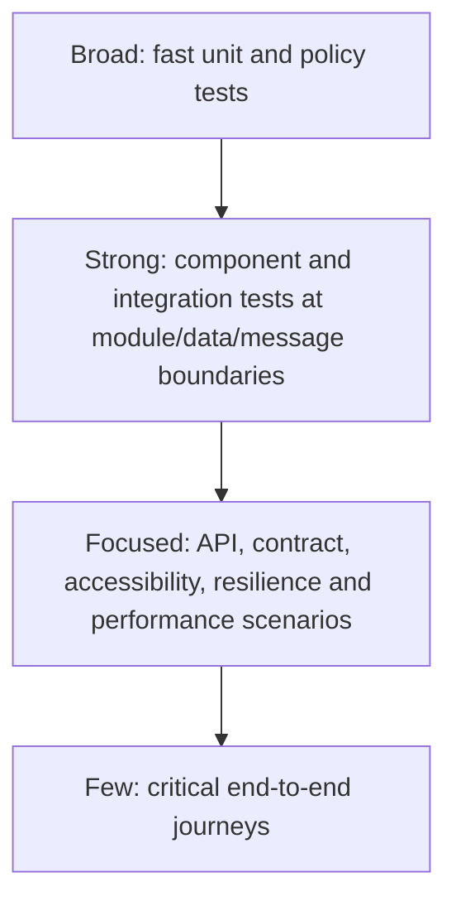

# AEGIS Quality Engineering and Test Strategy

## Purpose

This strategy defines how AEGIS builds confidence in product behavior and release decisions. It applies to design, implementation, delivery and operation. It is not an instruction to automate every test or to maximize a vanity test count.

The strategy is risk-based and evidence-driven. Quality ownership is shared: product clarifies value and acceptance, developers prevent and detect defects close to code, Quality Engineers shape coverage and investigation, security specialists challenge threats, and release owners make explicit decisions.

## Non-negotiable policy

> Never modify a test merely to make it pass.

A failing test is evidence to investigate. Determine whether the cause is product behavior, test design/implementation, requirement ambiguity, data, environment, tooling or an accepted change. A test may change only when the expected behavior or the test itself is demonstrably wrong, with review and traceability.

Tests must not be deleted, skipped, quarantined, retried into invisibility or weakened solely to obtain a green pipeline. Exceptions follow the flaky-test policy and remain visible.

## Quality Engineering principles

1. Prevent defects through clear requirements, examples, design review and simple boundaries.
2. Test at the lowest effective layer; add higher-layer coverage for integration and user confidence.
3. Prioritize by business impact, likelihood, detectability and change exposure.
4. Make production-relevant failures observable and reproducible in safe environments.
5. Treat test code, data and tooling as production-quality assets.
6. Separate product failures from test and infrastructure failures in reporting.
7. Preserve evidence, release candidate/build identity, environment and policy version.
8. Use automation for repeatable checks; use human exploration for discovery, ambiguity and experience.
9. Design accessibility, security, performance, resilience and data integrity from the start.
10. Prefer deterministic tests and controlled boundaries over sleeps and broad retries.
11. Do not use aggregate score to hide a critical failure.
12. Continuously refine coverage using defects, telemetry, change patterns and escaped risks.

## Quality activities across the lifecycle

| Stage | Activities | Evidence |
| --- | --- | --- |
| Discovery | Persona/risk analysis, examples, non-scope, abuse cases | reviewed requirements, assumptions, open questions |
| Design | Architecture/testability review, threat model, failure modes, contract/data design | design findings, ADRs, test approach |
| Implementation | Static analysis, unit/component tests, secure review, local exploratory checks | build/test reports and reviewed diff |
| Integration | API, database, contract, messaging and migration checks | versioned execution reports and traces |
| System | Critical E2E, accessibility, exploratory, performance and resilience scenarios | evidence linked to build/release |
| Release | Gate evaluation, traceability, residual-risk review and human decision | immutable evidence snapshot and rationale |
| Operation | Telemetry review, incident learning, synthetic checks where justified | alerts, traces, defect and regression links |

## Risk-based testing

### Risk model

Each capability is assessed using:

- **Impact:** business loss, security/privacy harm, data corruption, release credibility or recovery cost.
- **Likelihood:** complexity, novelty, change frequency, integration count and prior defects.
- **Detectability:** how likely existing controls reveal the problem before users do.
- **Exposure:** usage frequency and number of affected users/data items.

An initial qualitative rating (Critical, High, Medium, Low) is recorded in planning. A numerical model may support prioritization later but must remain explainable.

### Initial high-risk areas

| Area | Principal risks | Required emphasis |
| --- | --- | --- |
| Authentication/RBAC | account compromise, privilege escalation, enumeration | unit policy, API negative/abuse, security and audit checks |
| Price/stock/SKU | silent corruption, duplicates, lost updates | boundary/property tests, database constraints, concurrency and API tests |
| Media upload | malicious file, resource exhaustion, unauthorized access | content validation, authorization, security and resilience tests |
| Outbox/messaging | lost/duplicate changes, retry storm, stuck work | transactional integration, idempotency, restart and fault tests |
| Quality ingestion | wrong build attribution, duplicate/stale/malformed evidence | schema, idempotency, data-quality and authorization checks |
| Quality/release decision | critical risk hidden by score, non-reproducible result | deterministic policy tests, hard-gate tests, audit/traceability |
| Fault Lab | unintended blast radius or persistent fault | authorization, production-denial, TTL and emergency-stop tests |

Risk determines depth, independence and gate placement. Low risk does not mean no test; it may mean focused unit/API coverage and exploratory sampling rather than broad E2E automation.

## Test architecture: a practical pyramid



This is a feedback and isolation model, not a fixed percentage target. Most business permutations belong below the UI. E2E tests prove a small set of critical journeys and boundary integrations. Non-functional testing cuts across levels rather than sitting at the pyramid top.

## Test levels and types

### Unit testing

Scope: pure domain rules, value objects, validators, policies, mappers and state transitions with no real network/database.

Key examples:

- SKU normalization and uniqueness decision behavior;
- money/stock boundaries and product transition rules;
- permission and gate evaluation policies;
- quality score/risk formula, missing-data handling and hard-block override;
- retry classification/backoff calculation;
- event schema mapping and redaction.

Characteristics: milliseconds, deterministic, isolated, readable and broad boundary coverage. Property-based/parameterized tests are preferred for high-dimensional invariants. Mock only owned ports, not every internal method.

### Component testing

Scope: a module through its public application/API boundary with external dependencies replaced by realistic fakes or ephemeral dependencies as appropriate.

Purpose: verify wiring, serialization, authorization filters, error mapping and module behavior without starting the complete product. Component tests must not bypass the same validation/authorization paths used in production merely for convenience.

### Integration testing

Scope: actual integration with PostgreSQL, RabbitMQ, MinIO and the external mock adapter, introduced only in their phases.

Required scenarios include:

- migrations and database constraints;
- transaction rollback and optimistic concurrency;
- outbox atomicity, publisher restart and stuck-item reconciliation;
- duplicate delivery/idempotency, retry and dead-letter behavior;
- object upload/processing/cleanup and unavailable storage;
- worker timeout and downstream error classification.

Use production-compatible dependency versions in isolated containers where feasible. A mocked repository is not evidence that SQL constraints or transactions work.

### API testing

Scope: HTTP behavior independent of the UI.

Cover:

- happy, negative, boundary and state-transition paths;
- authentication versus authorization distinctions;
- object-level permission, mass assignment and injection inputs;
- validation/error schema and correlation ID;
- pagination maximums, deterministic ordering and filter combinations;
- concurrency and idempotency;
- content negotiation, size/rate controls and compatibility.

API tests carry most cross-feature functional coverage because they are faster and more diagnostic than UI E2E.

### Contract testing

Contracts include HTTP OpenAPI, event schemas, the External Sales Center Mock and quality-source ingestion formats.

- Provider schema/conformance checks protect AEGIS contracts.
- Consumer-driven examples protect assumptions about the downstream mock where useful.
- Compatibility tests detect breaking changes before merge.
- Contract tests validate failure/error behavior, timeouts and version rejection, not only successful payload fields.
- A mock is not considered correct merely because it matches the implementation; both are checked against the reviewed contract.

### End-to-end testing

Use Playwright + TypeScript for a deliberately small set of browser journeys after frontend exists. Initial candidate journeys:

1. authorized catalog operator creates and updates a product;
2. unauthorized user cannot mutate catalog state;
3. media operator uploads an image and observes processing outcome;
4. release manager reviews evidence, blocking gate, score/risk and records a decision;
5. QA navigates requirement-to-result-to-defect traceability.

E2E tests should use accessible roles/labels, stable domain-facing test hooks only when necessary, controlled data and explicit condition waits. Arbitrary sleeps are forbidden. UI tests do not duplicate every field combination covered at lower levels.

### Security testing

Security verification follows [SECURITY.md](SECURITY.md) and includes:

- static analysis, secret scanning and dependency/container scanning;
- authentication/session, RBAC and object-level authorization tests;
- input validation, injection and unsafe error disclosure checks;
- upload polyglot/signature/size/decompression and retrieval tests;
- API abuse/rate-limit, CSRF/CORS/security-header tests as architecture requires;
- message/evidence provenance and replay/forgery checks;
- manual threat-driven testing for high-risk features.

Automated scanners produce candidates, not automatically accepted defects. Findings require triage, exploitability context, remediation and retest. Critical exploitable findings block under [QUALITY_GATES.md](QUALITY_GATES.md).

### Performance testing

Use k6 for version-controlled API workload models after relevant endpoints stabilize. Test categories:

- smoke: script/environment correctness;
- baseline: reproducible normal workload;
- load: expected concurrency/volume;
- stress: discover limits, never a routine release requirement without need;
- soak: leaks/queue buildup over time where justified;
- spike: sudden ingest/catalog burst where risk warrants.

Every result records release candidate/commit/build, environment, dataset, dependency versions, workload, warm-up, duration and resource context. Evaluate latency percentiles, throughput, error rate, saturation, queue age and recovery—not average latency alone. Thresholds must use a controlled reference profile and distinguish product errors from load-generator/environment limits.

Initial provisional targets are in [REQUIREMENTS.md](REQUIREMENTS.md#non-functional-requirements); baselines must validate them before hard gating.

### Resilience testing

Resilience checks validate behavior during and after controlled faults:

- downstream unavailable, timeout and slow responses;
- broker unavailable, backlog and duplicate delivery;
- database latency or connection exhaustion;
- image processor/object storage failure;
- random internal HTTP 500;
- worker restart during processing;
- Quality Engine or evidence source unavailable.

Each experiment states hypothesis, steady state, injected fault, blast radius, expected telemetry, abort condition and recovery criterion. Fault Lab is non-production, permission-protected, defaults off, has TTL and emergency stop. Passing means the system fails as designed and recovers without silent loss—not that no error occurred.

### Accessibility testing

Target WCAG 2.2 AA for supported critical workflows. Combine:

- semantic design/component review;
- automated rules in component and Playwright checks;
- keyboard-only navigation and visible focus;
- screen-reader smoke checks on critical journeys;
- zoom/reflow, contrast, error identification and status announcement;
- reduced-motion and non-color-only cues where applicable.

Automated accessibility tools detect only a subset; manual evaluation is required before a critical UI workflow is called accessible.

### Data quality testing

Validate both commerce data and quality evidence:

- database constraints, nullability, precision and normalized uniqueness;
- migrations against representative data and rollback/forward recovery plan;
- before/after history accuracy and audit attribution;
- event/database reconciliation and duplicate detection;
- evidence schema, source, release/build identity, timestamp/freshness and checksum/reference;
- aggregation correctness for pass rate, severity counts, percentiles and score inputs;
- missing, late, duplicated, conflicting and out-of-order inputs;
- retention/redaction and orphan detection.

Quality dashboards must never turn unknown or stale input into zero/pass.

### Exploratory testing

Time-boxed charters target ambiguity, workflows, error recovery and cross-domain interactions. A charter records mission, build/environment, data, observations, evidence, defects and remaining questions. Suggested early tours include catalog boundary/concurrency, permission misuse, hostile uploads, retry/replay and release-decision explanation.

## Static checks and review

When code exists, fast pull-request checks should include compilation/type checking, formatting/linting, unit/component tests, dependency/secret scanning and contract compatibility as applicable. Review examines correctness, clarity, testability, security, telemetry, migration/recovery and documentation—not coverage percentage alone.

## Test environments

| Environment | Purpose | Data | Expected controls |
| --- | --- | --- | --- |
| Local | rapid development and focused testing | generated/seeded synthetic data | reproducible dependencies, safe defaults, no real secrets |
| CI ephemeral | isolated automated validation per change | deterministic synthetic factories/seeds | pinned versions, parallel isolation, retained reports on failure |
| Integration | cross-component, contract and migration scenarios | synthetic representative dataset | controlled resets, external mock, broker/storage as phases add them |
| Performance | reproducible workload baseline | versioned larger synthetic dataset | stable resource profile, exclusive/noisy-neighbor awareness |
| Demo/staging | portfolio journey and exploratory validation | synthetic demo identities/data | production-like configuration where practical, no production data |
| Production (future) | real operation, not destructive test playground | real governed data | no Fault Lab; safe smoke/synthetic monitoring only if approved |

Environment parity is risk-based. Differences in versions, configuration, topology and feature flags are documented alongside results. No test requires a developer's unrecorded machine state.

## Test data strategy

- Use synthetic, deterministic data by default; never copy production personal data into lower environments.
- Provide builders/factories with domain-valid defaults and explicit overrides.
- Generate unique test identity/SKU keys without relying on execution order.
- Seed a small, versioned reference dataset for demos/contracts and a separate scalable dataset for performance.
- Create data through the layer under test unless setup cost would obscure the target; lower-level setup must preserve required invariants.
- Isolate parallel runs through unique namespaces/IDs and clean up safely; tests must tolerate diagnostic retention on failure.
- Treat clock, timezone, locale, currency, Unicode and numeric boundaries as explicit dimensions.
- Redact secrets/personal data in reports, screenshots, traces and failure messages.
- Test cleanup never targets broad or ambiguous environments and never hides an earlier test failure.

## Evidence policy

Minimum execution provenance:

- requirement/test case IDs where applicable;
- release candidate, source commit and immutable build/artifact identity;
- test/tool version and command/profile;
- environment and relevant dependency/config versions;
- start/end time, result, duration and attempt history;
- sanitized failure classification/message;
- links/checksums for reports, screenshots, videos, logs and traces as appropriate;
- correlation/trace ID for cross-boundary failures.

Evidence is proportionate: do not collect sensitive or enormous artifacts by default. Passing runs may retain summaries; failures and release-gate executions retain diagnostic artifacts under an explicit retention/access policy. Screenshots alone are insufficient proof of backend/data correctness.

## Traceability

The target chain is:

```text
Requirement -> Test Case -> Test Execution -> Evidence -> Defect -> Release
```

- Requirement IDs originate in [REQUIREMENTS.md](REQUIREMENTS.md).
- Automated tests include stable case/requirement metadata without making names unreadable.
- Runs and results attach to an exact release candidate/build; the release display version alone is insufficient.
- Defects link the failed expectation, evidence and affected requirement/release.
- Traceability reports show both links and gaps; a missing link is not synthesized.
- Regression coverage is chosen using risk, affected modules/contracts and historical defects, not traceability alone.

## Defect lifecycle

1. **Observed:** preserve environment, build, data, steps, expected/actual and evidence.
2. **Triaged:** confirm reproducibility, classify product/test/environment/requirement issue, severity, priority and owner.
3. **Accepted:** decide repair, defer, duplicate or not-a-defect with rationale and affected requirements/releases.
4. **In progress:** implement the smallest correct change and add/adjust legitimate prevention/detection coverage.
5. **Ready for retest:** identify build and impacted regression scope.
6. **Verified/closed:** reproduce original scenario, verify fix and targeted regression; retain evidence/history.
7. **Reopened:** if behavior persists/regresses, add new evidence without overwriting prior verification.

Severity describes impact; priority describes scheduling. A flaky failure or environment failure is still tracked and owned, not relabeled as product pass.

## Automation principles

- Automate when repetition, regression risk, data permutations or rapid feedback justify maintenance cost.
- Keep assertions focused on business outcomes and contracts, not incidental implementation.
- Prefer public interfaces and accessible locators; avoid database assertions as the only proof of user-visible behavior.
- No shared mutable test order, unconditional sleep, infinite retry or catch-and-ignore.
- Retry exists to characterize transient behavior, not to conceal it; all attempts remain visible.
- Test utilities remain simpler than the behavior they verify and receive review/testing proportional to risk.
- Generated reports are artifacts, not source-controlled noise.
- Coverage metrics reveal unexercised code/requirements but do not prove assertion quality.

## Flaky test policy

A flaky test has inconsistent outcomes for the same relevant product/configuration/input. Suspected flakiness triggers:

1. preserve every attempt and initial failure evidence;
2. create a tracked issue with owner, severity, affected suite and first/last seen;
3. classify likely source: product nondeterminism, test, data, environment or tool;
4. reproduce under controlled repetition and use telemetry to locate the race/boundary;
5. fix root cause and prove stability through an agreed repeated run;
6. add learning to utilities/standards when systemic.

Quarantine is a last, time-bounded containment action approved by a responsible owner. A quarantined test:

- remains executed and reported separately where feasible;
- never counts as passed;
- has an issue, owner and expiry;
- cannot remove coverage for a critical hard gate without replacement evidence and explicit release risk;
- is restored or replaced after root-cause repair.

Global retries that turn eventual success into an unqualified pass are forbidden. Report first-attempt pass rate and retry outcome separately.

## Entry and exit expectations

Before a feature enters implementation, applicable requirements, examples, risks, security concerns, observability and test approach should be understood. Before it is considered done, relevant build/lint/tests, security review, documentation, telemetry and traceability pass according to [AGENTS.md](../AGENTS.md) and [QUALITY_GATES.md](QUALITY_GATES.md).

## Strategy metrics

Useful signals include escaped defect patterns, failure detection layer, change failure/reopen rate, first-attempt stability, critical requirement coverage, evidence freshness, mean time to diagnose and gate exception age. These metrics guide improvement and must not be used to rank individuals or incentivize superficial test counts.

## Open questions and calibration needs

- Exact supported browsers/devices and accessibility manual-test matrix.
- Reference hardware/dataset/workloads for performance thresholds.
- Evidence retention, storage and access policy.
- Required independence for release/security evaluation in a portfolio-sized team.
- Source of truth for manual test cases and defects before Quality Control Center exists.
- Acceptable quarantine duration by risk class.
- Minimum score weights and required evidence freshness for each release class.
